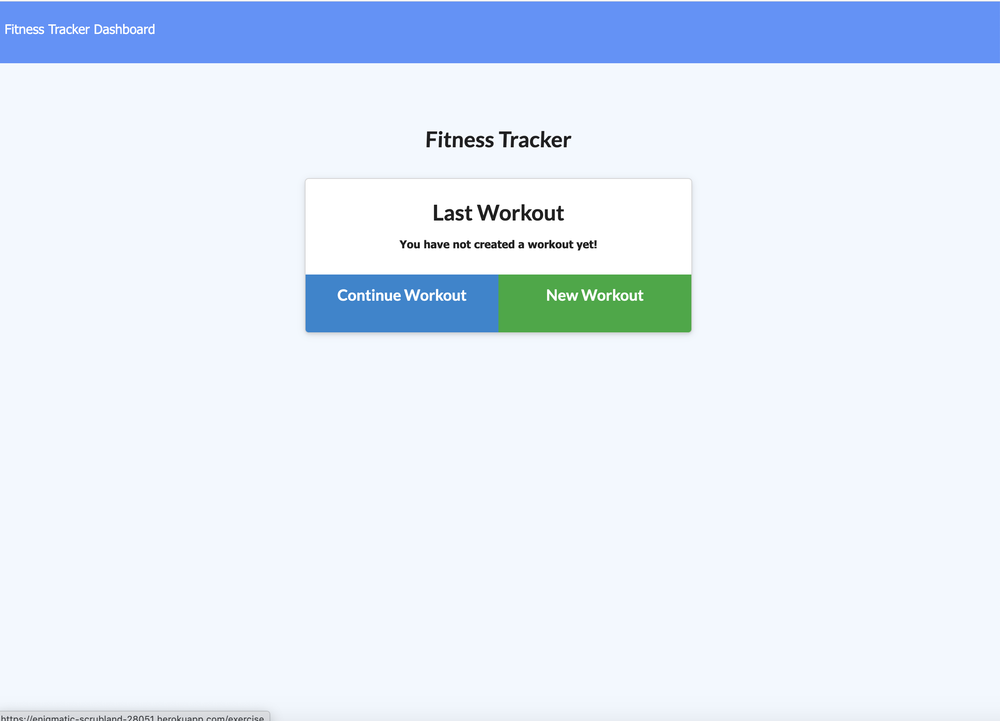
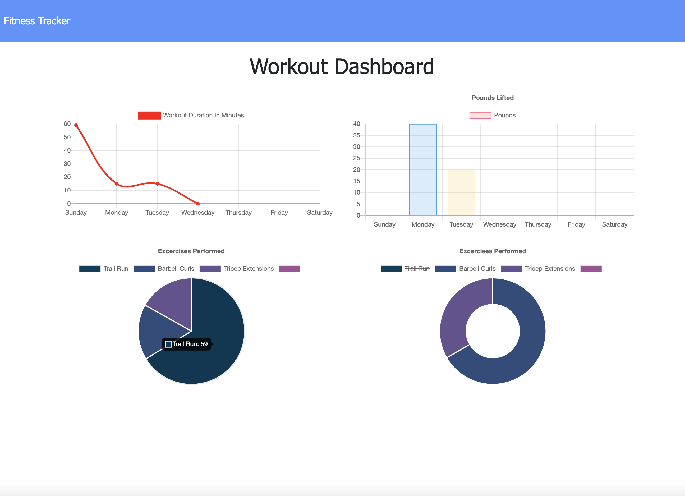

# Fitness Tracker

Easily track your workouts, and view a weekly dashboard to visualize them.

## Description

## Table of Contents

  - [Repository](#Repository)
  - [Installation](#Installation)
  - [Usage](#Usage)
  - [License](#License)
  - [Contributors](#Contributors)
  - [Contact Author](#Contact)
  - [See it in Action](#Demo)

  ## Repository

  - [Project Repo](https://github.com/maxgerringer/workout-tracker)

  ## Installation

  Begin by installing the package dependencies:

             npm install

  ## Live link:

  https://enigmatic-scrubland-28051.herokuapp.com/

  Execute the application with this command locally on port 3300: 

             node server.js

  ## License

  

  ## Contributors

  Max R. Gerringer

  ## Contact

  - <max.gerringer@gmail.com>
  - Max R. Gerringer
  - [GitHub Profile](https://github.com/maxgerringer)

  ## Demo

 

 
